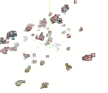

# Metric Learning for Novelty and Anomaly Detection
This [paper](https://bmvc2018.org/contents/papers/0178.pdf) has been accepted at BMVC 2018. An [arXiv pre-print](https://arxiv.org/abs/1808.05492) including the supplementary material is also available. Code will be available soon.

## Citation
```
@InProceedings{masana2018metric,
author = {Masana, Marc and Ruiz, Idoia and Serrat, Joan and van de Weijer, Joost and Lopez, Antonio M},
title = {Metric Learning for Novelty and Anomaly Detection},
booktitle = {British Machine Vision Conference (BMVC)},
year = {2018}
}
```

## Abstract
When neural networks process images which do not resemble the distribution seen during training, so called out-of-distribution images, they often make wrong predictions, and do so too confidently. The capability to detect out-of-distribution images is therefore crucial for many real-world applications. We divide out-of-distribution detection between novelty detection ---images of classes which are not in the training set but are related to those---, and anomaly detection ---images with classes which are unrelated to the training set. By related we mean they contain the same type of objects, like digits in MNIST and SVHN. Most existing work has focused on anomaly detection, and has addressed this problem considering networks trained with the cross-entropy loss. Differently from them, we propose to use metric learning which does not have the drawback of the softmax layer (inherent to cross-entropy methods), which forces the network to divide its prediction power over the learned classes. We perform extensive experiments and evaluate both novelty and anomaly detection, even in a relevant application such as traffic sign recognition, obtaining comparable or better results than previous works.

## Embedding visualization for Tsinghua

### Metric learning


In-dist: Tsinghua (blue), Out-dist: Tsinghua unseen classes (yellow)


In-dist: Tsinghua (blue), Out-dist: Background patches (yellow)


In-dist: Tsinghua (blue), Out-dist: Gaussian noise (yellow)


### ODM
Seen out-distribution: Tsinghua



Embedding learned for the known classes


In-dist: Tsinghua (blue), Out-dist: Tsinghua unseen classes (yellow)


In-dist: Tsinghua (blue), Out-dist: Background patches (yellow)


In-dist: Tsinghua (blue), Out-dist: Gaussian noise (yellow)
